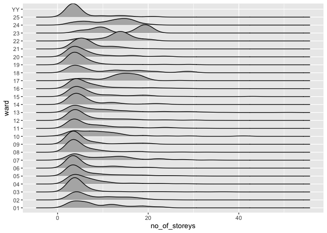

*To complete this milestone, you can either edit [this `.rmd`
file](https://raw.githubusercontent.com/UBC-STAT/stat545.stat.ubc.ca/master/content/mini-project/mini-project-2.Rmd)
directly. Fill in the sections that are commented out with
`<!--- start your work here--->`. When you are done, make sure to knit
to an `.md` file by changing the output in the YAML header to
`github_document`, before submitting a tagged release on canvas.*

# Welcome back to your mini data analysis project!

This time, we will explore more in depth the concept of *tidy data*, and
hopefully investigate further into your research questions that you
defined in milestone 1.

**NOTE**: The main purpose of the mini data analysis is to integrate
what you learn in class in an analysis. Although each milestone provides
a framework for you to conduct your analysis, it’s possible that you
might find the instructions too rigid for your data set. If this is the
case, you may deviate from the instructions – just make sure you’re
demonstrating a wide range of tools and techniques taught in this class.

Begin by loading your data and the tidyverse package below:

    library(datateachr) # <- might contain the data you picked!
    library(tidyverse)

    ## Warning: package 'tidyverse' was built under R version 4.0.2

    ## Warning: package 'ggplot2' was built under R version 4.0.2

    ## Warning: package 'tibble' was built under R version 4.0.2

    ## Warning: package 'tidyr' was built under R version 4.0.2

    ## Warning: package 'readr' was built under R version 4.0.2

    ## Warning: package 'dplyr' was built under R version 4.0.2

    ## Warning: package 'forcats' was built under R version 4.0.2

    library(ggplot2)
    library(forcats)
    library(plyr)
    library(dplyr)

# Learning Objectives

By the end of this milestone, you should:

-   Become familiar with manipulating and summarizing your data in
    tibbles using `dplyr` and `tidyr`, with a research question in mind.
-   Understand what *tidy* data is, and how to create it. In milestone
    3, we will explore when this might be useful.
-   Generate a reproducible and clear report using R Markdown.
-   Gain a greater understanding of how to use R to answer research
    questions about your data.

**Things to keep in mind**

-   Remember to document your code, be explicit about what you are
    doing, and write notes in this markdown document when you feel that
    context is required. Create your analysis as if someone else will be
    reading it! **There will be 2.5 points reserved for reproducibility,
    readability, and repo organization.**

-   Before working on each task, you should always keep in mind the
    specific **research question** that you’re trying to answer.

# Task 1: Process and summarize your data (15 points)

From milestone 1, you should have an idea of the basic structure of your
dataset (e.g. number of rows and columns, class types, etc.). Here, we
will start investigating your data more in-depth using various data
manipulation functions.

### 1.1 (2.5 points)

First, write out the 4 research questions you defined in milestone 1
were. This will guide your work through milestone 2:

    # Summary of *apt_buildings* data set for reference:

    str(apt_buildings)

    ## tibble [3,455 × 37] (S3: tbl_df/tbl/data.frame)
    ##  $ id                              : num [1:3455] 10359 10360 10361 10362 10363 ...
    ##  $ air_conditioning                : chr [1:3455] "NONE" "NONE" "NONE" "NONE" ...
    ##  $ amenities                       : chr [1:3455] "Outdoor rec facilities" "Outdoor pool" NA NA ...
    ##  $ balconies                       : chr [1:3455] "YES" "YES" "YES" "YES" ...
    ##  $ barrier_free_accessibilty_entr  : chr [1:3455] "YES" "NO" "NO" "YES" ...
    ##  $ bike_parking                    : chr [1:3455] "0 indoor parking spots and 10 outdoor parking spots" "0 indoor parking spots and 34 outdoor parking spots" "Not Available" "Not Available" ...
    ##  $ exterior_fire_escape            : chr [1:3455] "NO" "NO" "NO" "YES" ...
    ##  $ fire_alarm                      : chr [1:3455] "YES" "YES" "YES" "YES" ...
    ##  $ garbage_chutes                  : chr [1:3455] "YES" "YES" "NO" "NO" ...
    ##  $ heating_type                    : chr [1:3455] "HOT WATER" "HOT WATER" "HOT WATER" "HOT WATER" ...
    ##  $ intercom                        : chr [1:3455] "YES" "YES" "YES" "YES" ...
    ##  $ laundry_room                    : chr [1:3455] "YES" "YES" "YES" "YES" ...
    ##  $ locker_or_storage_room          : chr [1:3455] "NO" "YES" "YES" "YES" ...
    ##  $ no_of_elevators                 : num [1:3455] 3 3 0 1 0 0 0 2 4 2 ...
    ##  $ parking_type                    : chr [1:3455] "Underground Garage , Garage accessible thru buildg" "Underground Garage , Garage accessible thru buildg , Surface Parking" "Underground Garage , Garage accessible thru buildg , Surface Parking" "Ground Level Garage , Surface Parking" ...
    ##  $ pets_allowed                    : chr [1:3455] "YES" "YES" "YES" "YES" ...
    ##  $ prop_management_company_name    : chr [1:3455] NA "SCHICKEDANZ BROS. PROPERTIES" NA "FREIMAN INVESTMENTS" ...
    ##  $ property_type                   : chr [1:3455] "PRIVATE" "PRIVATE" "PRIVATE" "PRIVATE" ...
    ##  $ rsn                             : num [1:3455] 4154812 4154815 4155295 4155309 4155318 ...
    ##  $ separate_gas_meters             : chr [1:3455] "NO" "NO" "NO" "NO" ...
    ##  $ separate_hydro_meters           : chr [1:3455] "YES" "YES" "YES" "YES" ...
    ##  $ separate_water_meters           : chr [1:3455] "NO" "NO" "NO" "NO" ...
    ##  $ site_address                    : chr [1:3455] "65  FOREST MANOR RD" "70  CLIPPER RD" "2651  BLOOR ST W" "22  BURNHAMTHORPE RD" ...
    ##  $ sprinkler_system                : chr [1:3455] "YES" "YES" "NO" "YES" ...
    ##  $ visitor_parking                 : chr [1:3455] "PAID" "FREE" "UNAVAILABLE" "UNAVAILABLE" ...
    ##  $ ward                            : chr [1:3455] "17" "17" "03" "03" ...
    ##  $ window_type                     : chr [1:3455] "DOUBLE PANE" "DOUBLE PANE" "DOUBLE PANE" "DOUBLE PANE" ...
    ##  $ year_built                      : num [1:3455] 1967 1970 1927 1959 1943 ...
    ##  $ year_registered                 : num [1:3455] 2017 2017 2017 2017 2017 ...
    ##  $ no_of_storeys                   : num [1:3455] 17 14 4 5 4 4 4 7 32 4 ...
    ##  $ emergency_power                 : chr [1:3455] "NO" "YES" "NO" "NO" ...
    ##  $ non-smoking_building            : chr [1:3455] "YES" "NO" "YES" "YES" ...
    ##  $ no_of_units                     : num [1:3455] 218 206 34 42 25 34 14 105 571 171 ...
    ##  $ no_of_accessible_parking_spaces : num [1:3455] 8 10 20 42 12 0 5 1 1 6 ...
    ##  $ facilities_available            : chr [1:3455] "Recycling bins" "Green Bin / Organics" "Green Bin / Organics" "Green Bin / Organics" ...
    ##  $ cooling_room                    : chr [1:3455] "NO" "NO" "NO" "NO" ...
    ##  $ no_barrier_free_accessible_units: num [1:3455] 2 0 0 42 0 NA 14 0 0 1 ...

#### 1.1.1. Research question 1: Investigating the relationship between building age and building height

Investigate the relationship between building age and building height.
One could hypothesize that newer buildings might tend to be taller as
construction technology has improved and urban density has increased.

#### 1.1.2. Research question 2: Investigating the relationship between building height, number of units, and balconies

Investigate the relationship between building height, number of units,
and balconies. One could hypothesize that, given constant area per floor
and area per unit, building height and number of units would display a
positive correlation. Similarly, one could hypothesize that higher
buildings or buildings with more units are more likely to have
balconies.

#### 1.1.3. Research question 3: Investigating building age dependency of air conditioning type

Investigate the relationship between building age and air conditioning
type. For example, one could hypothesize that newer buildings might more
frequently have central air conditioning, while older buildings might
more frequently lack air conditioning.

#### 1.1.4. Research question 4: Investigating the relationship between building height and ward

Investigate the relationship between building height and city ward. One
could hypothesize that buildings in denser downtown wards might tend to
be higher, while buildings in outlying suburban wards might tend to be
shorter.

### 1.2 (10 points)

Now, for each of your four research questions, choose one task from
options 1-4 (summarizing), and one other task from 4-8 (graphing). You
should have 2 tasks done for each research question (8 total). Make sure
it makes sense to do them! (e.g. don’t use a numerical variables for a
task that needs a categorical variable.). Comment on why each task helps
(or doesn’t!) answer the corresponding research question.

Ensure that the output of each operation is printed!

**Summarizing:**

1.  Compute the *range*, *mean*, and *two other summary statistics* of
    **one numerical variable** across the groups of **one categorical
    variable** from your data.
2.  Compute the number of observations for at least one of your
    categorical variables. Do not use the function `table()`!
3.  Create a categorical variable with 3 or more groups from an existing
    numerical variable. You can use this new variable in the other
    tasks! *An example: age in years into “child, teen, adult, senior”.*
4.  Based on two categorical variables, calculate two summary statistics
    of your choosing.

**Graphing:**

1.  Create a graph out of summarized variables that has at least two
    geom layers.
2.  Create a graph of your choosing, make one of the axes logarithmic,
    and format the axes labels so that they are “pretty” or easier to
    read.
3.  Make a graph where it makes sense to customize the alpha
    transparency.
4.  Create 3 histograms out of summarized variables, with each histogram
    having different sized bins. Pick the “best” one and explain why it
    is the best

Make sure it’s clear what research question you are doing each operation
for!

<!------------------------- Start your work below ----------------------------->

#### 1.2.1. Research question 1: Investigating the relationship between building age and number of storeys

This question will be investigated using options 3 and 5.

For option 3 (creating a categorical variable by grouping a numerical
variable), building age will be grouped into categories by 25-year
period. Groups will be: 1899 & before, 1900-1924, 1925-1949, 1950-1974,
1975-1999, and 2000 & later.

    # Use mutate function to assign age category to a new column named *age_cat*
    # *case_when* determines the age range based on the value of *year_built*

    apt_buildings_age_cat <- apt_buildings %>%  
      mutate(age_cat = case_when(year_built < 1900 ~ "1899 & before",
                                 year_built < 1925 ~ "1900-1924",
                                 year_built < 1950 ~ "1925-1950",
                                 year_built < 2000 ~ "1950-1999",
                                    TRUE ~ "2000 & later"))

    head(apt_buildings_age_cat)

    ## # A tibble: 6 × 38
    ##      id air_conditioning amenities   balconies barrier_free_acc… bike_parking   
    ##   <dbl> <chr>            <chr>       <chr>     <chr>             <chr>          
    ## 1 10359 NONE             Outdoor re… YES       YES               0 indoor parki…
    ## 2 10360 NONE             Outdoor po… YES       NO                0 indoor parki…
    ## 3 10361 NONE             <NA>        YES       NO                Not Available  
    ## 4 10362 NONE             <NA>        YES       YES               Not Available  
    ## 5 10363 NONE             <NA>        NO        NO                12 indoor park…
    ## 6 10364 NONE             <NA>        NO        NO                Not Available  
    ## # … with 32 more variables: exterior_fire_escape <chr>, fire_alarm <chr>,
    ## #   garbage_chutes <chr>, heating_type <chr>, intercom <chr>,
    ## #   laundry_room <chr>, locker_or_storage_room <chr>, no_of_elevators <dbl>,
    ## #   parking_type <chr>, pets_allowed <chr>, prop_management_company_name <chr>,
    ## #   property_type <chr>, rsn <dbl>, separate_gas_meters <chr>,
    ## #   separate_hydro_meters <chr>, separate_water_meters <chr>,
    ## #   site_address <chr>, sprinkler_system <chr>, visitor_parking <chr>, …

For option 5 (creating a graph of the summarized variables with 2+ geom
layers), a box plot will be created for number of storeys in each age
category.

    # Use standard ggplot syntax to display the number of storeys (y axis) of each 
    # age category (x axis) in boxplot format.
    # Specify x and y axis labels and a title, and select *theme_bw* as the colour palette

    apt_buildings_age_cat %>%
      ggplot() + geom_boxplot(aes(x = age_cat, y = no_of_storeys)) +
        labs(y = "Number of floors", x = "Age range") +
        ggtitle("Number of floors distribution in each age range") +
        theme_bw() 

This plot shows that there is a general increase in number of floors
over time. However, there is little change in median number of floors
until 1950. After 1950, the median number of floors increases somewhat.
However, despite the moderate increase in mean after 1950, the most
dramatic difference is the appearance of numerous outliers with as many
as 40-50 floors. We might attribute this change to postwar changes in
zoning rules and construction technology.

#### 1.2.2. Research question 2: Investigating the relationship between number of storeys, number of units, and balconies

This question will be investigated using options 1 and 7.

For option 1 (compute the range, mean, and two other summary stats of
one numerical variable across categories), the summary stats will be
calculated for the numerical variable number of units across the
categories of balcony and no balcony.

    # The data set is grouped by the categories of the balconies column
    # The summarise function is then used to calculate the mean of each group

    (apt_buildings %>%
      group_by(balconies) %>%
      summarise(no_of_units_mean = mean(no_of_units)))

    ##   no_of_units_mean
    ## 1         91.09117

    # The data set is grouped by the categories of the balconies column
    # The summarise function is then used to calculate the rage of each group

    (apt_buildings %>%
      group_by(balconies) %>%
      summarise(no_of_units_range = range(no_of_units)))

    ##   no_of_units_range
    ## 1                 0
    ## 2              4111

    # The data set is grouped by the categories of the balconies column
    # The summarise function is then used to calculate the median of each group

    (apt_buildings %>%
      group_by(balconies) %>%
      summarise(no_of_units_median = median(no_of_units)))

    ##   no_of_units_median
    ## 1                 52

    # The data set is grouped by the categories of the balconies column
    # The summarise function is then used to calculate the standard deviation of each group

    (apt_buildings %>%
      group_by(balconies) %>%
      summarise(no_of_units_sd = sd(no_of_units)))

    ##   no_of_units_sd
    ## 1        117.102

For option 7 (graph with customized alpha transparency), a scatter plot
will be created with number of units on the x axis and building height
on the y axis. Separate graphs will be created for buildings with
balconies and no balconies. Alpha transparency will be applied to the
data points to demonstrate density of observations.

    #(apt_buildings_scatter_plot <- ggplot(apt_buildings) +
    #    geom_point(aes(no_of_storeys, no_of_units), alpha = 0.2))

    (apt_buildings_scatter_plot <- ggplot(apt_buildings, aes(no_of_storeys, no_of_units)) +
      geom_point(aes(color = balconies),
                size = 3,
                alpha = 0.4)) + facet_grid(balconies ~ .)

This plot repeats the result from milestone 1 that number of units and
number of storeys are positively correlated. In terms of balconies, it
seems that buildings with balconies are somewhat more distributed in the
higher range of units/floors than those without.

#### 1.2.3. Research question 3: Investigating building age dependency of air conditioning type

This question will be investigated using options 1 and 5.

For option 1 (compute the range, mean, and two other summary stats of
one categorical variable), the summary stats will be calculated for the
categories of air conditioning type.

    # The data set is grouped by the categories of the air conditioning column
    # The summarise function is then used to calculate the mean of each group

    (apt_buildings %>%
      group_by(air_conditioning) %>%
      summarise(year_built_mean = mean(year_built)))

    ##   year_built_mean
    ## 1              NA

    # The data set is grouped by the categories of the air conditioning column
    # The summarise function is then used to calculate the range of each group

    (apt_buildings %>%
      group_by(air_conditioning) %>%
      summarise(year_built_range = range(year_built)))

    ##   year_built_range
    ## 1               NA
    ## 2               NA

    # The data set is grouped by the categories of the air conditioning column
    # The summarise function is then used to calculate the median of each group

    (apt_buildings %>%
      group_by(air_conditioning) %>%
      summarise(year_built_median = median(year_built)))

    ##   year_built_median
    ## 1                NA

    # The data set is grouped by the categories of the air conditioning column
    # The summarise function is then used to calculate the standard deviation of each group

    (apt_buildings %>%
      group_by(air_conditioning) %>%
      summarise(year_built_sd = sd(year_built)))

    ##   year_built_sd
    ## 1            NA

For option 5 (creating a graph of the summarized variables with 2+ geom
layers), a box plot will be created for building height in each air
conditioning category.

    # Use standard ggplot syntax to display the number of storeys (y axis) of each 
    # age category (x axis) in boxplot format.
    # Specify x and y axis labels and a title, and select *theme_bw* as the colour palette

    apt_buildings_age_cat %>%
      ggplot() + geom_boxplot(aes(x = air_conditioning, y = year_built)) +
        labs(y = "Year built", x = "Type of Air Conditioning") +
        ggtitle("Age range distribution in each air conditioning category") +
        theme_bw() 

    ## Warning: Removed 13 rows containing non-finite values (stat_boxplot).

This plot further demonstrates the trend that central air is more common
in newer buildings, and very rare in buildings before 1950. Buildings
with individual units have a slightly newer median construction year
than those with no air conditioning. However, there are many more recent
outliers in the *individual units* and *none* categories, showing that
buildings with these air conditioning types are still being built.

#### 1.2.4. Research question 4: Investigating the relationship between building height and ward

This question will be investigated using options 2 and 6.

For option 2 (calculate number of observations for one categorical
variable), the number of buildings in each ward will be computed.

    # The count function is used to calculate the number of entries in each ward category. 

    count(apt_buildings, 'ward')

    ##    ward freq
    ## 1    01   81
    ## 2    02  130
    ## 3    03  240
    ## 4    04  198
    ## 5    05  233
    ## 6    06  236
    ## 7    07  102
    ## 8    08  242
    ## 9    09   89
    ## 10   10   47
    ## 11   11  132
    ## 12   12  331
    ## 13   13  208
    ## 14   14  131
    ## 15   15  168
    ## 16   16  155
    ## 17   17   62
    ## 18   18   46
    ## 19   19  173
    ## 20   20  159
    ## 21   21  135
    ## 22   22   42
    ## 23   23    8
    ## 24   24   78
    ## 25   25   28
    ## 26   YY    1

For option 6 (chosen graph with one log axis and “pretty labels”), the
distribution of buildings in each ward will be shown using a ridge plot.

    # ggplot is used to create a plot with number of stories and ward as the x and y variables respectively
    # the ggridges package is loaded and the geom_density_ridges function is used to create the ridge plot

    apt_buildings %>% 
       ggplot(aes(no_of_storeys, ward)) +
       ggridges::geom_density_ridges()

    ## Picking joint bandwidth of 1.56

This plot shows interesting trends in frequency of number of storeys for
each ward. Most wards show a hump around 4 storeys, with some showing
additional smaller humps at values up to 20 storeys. This means that
these neighbourhoods are mostly low-rise, with occasional taller
buildings. However, certain wards such as 17, 22, 23, and 24 do not show
the hump around 4 storeys, and instead show humps at values up to 20
storeys. This indicates that these are higher density neighbourhoods,
potentially high-rise social housing projects.

<!----------------------------------------------------------------------------->

### 1.3 (2.5 points)

Based on the operations that you’ve completed, how much closer are you
to answering your research questions? Think about what aspects of your
research questions remain unclear. Can your research questions be
refined, now that you’ve investigated your data a bit more? Which
research questions are yielding interesting results?

<!------------------------- Write your answer here ---------------------------->

These results provide useful answers to the four research questions
addressed in this analysis. However, more detailed investigates of all
four relationships are still possible. Research questions 3 and 4 are
yielding particularly interesting results, with various questions left
to investigate further.

<!----------------------------------------------------------------------------->

# Task 2: Tidy your data (12.5 points)

In this task, we will do several exercises to reshape our data. The goal
here is to understand how to do this reshaping with the `tidyr` package.

A reminder of the definition of *tidy* data:

-   Each row is an **observation**
-   Each column is a **variable**
-   Each cell is a **value**

*Tidy’ing* data is sometimes necessary because it can simplify
computation. Other times it can be nice to organize data so that it can
be easier to understand when read manually.

### 2.1 (2.5 points)

Based on the definition above, can you identify if your data is tidy or
untidy? Go through all your columns, or if you have &gt;8 variables,
just pick 8, and explain whether the data is untidy or tidy.

<!--------------------------- Start your work below --------------------------->

The data is currently in tidy form, because each row represents one
observation (i.e. one apartment building). For that reason, it would not
be reasonably possible to further reduce the number of rows.

<!----------------------------------------------------------------------------->

### 2.2 (5 points)

Now, if your data is tidy, untidy it! Then, tidy it back to it’s
original state.

If your data is untidy, then tidy it! Then, untidy it back to it’s
original state.

Be sure to explain your reasoning for this task. Show us the “before”
and “after”.

<!--------------------------- Start your work below --------------------------->

    # To simplify, select only 8 columns of the table. 

    selected_apt_buildings <- select(apt_buildings, id, separate_gas_meters, separate_hydro_meters, separate_water_meters, no_of_units, ward, air_conditioning, heating_type)

    head(selected_apt_buildings)

    ## # A tibble: 6 × 8
    ##      id separate_gas_met… separate_hydro_me… separate_water_m… no_of_units ward 
    ##   <dbl> <chr>             <chr>              <chr>                   <dbl> <chr>
    ## 1 10359 NO                YES                NO                        218 17   
    ## 2 10360 NO                YES                NO                        206 17   
    ## 3 10361 NO                YES                NO                         34 03   
    ## 4 10362 NO                YES                NO                         42 03   
    ## 5 10363 NO                YES                NO                         25 02   
    ## 6 10364 NO                YES                NO                         34 02   
    ## # … with 2 more variables: air_conditioning <chr>, heating_type <chr>

    # Because the data is already tidy, choose to untidy by adding separate rows for each apartment building's separate utility meters

    (untidy <- selected_apt_buildings %>%
      pivot_longer(cols = c(separate_gas_meters, separate_hydro_meters, separate_water_meters), 
                   names_to  = "utility_meter", 
                   values_to = "utility_meter_separate"))

    ## # A tibble: 10,365 × 7
    ##       id no_of_units ward  air_conditioning heating_type utility_meter        
    ##    <dbl>       <dbl> <chr> <chr>            <chr>        <chr>                
    ##  1 10359         218 17    NONE             HOT WATER    separate_gas_meters  
    ##  2 10359         218 17    NONE             HOT WATER    separate_hydro_meters
    ##  3 10359         218 17    NONE             HOT WATER    separate_water_meters
    ##  4 10360         206 17    NONE             HOT WATER    separate_gas_meters  
    ##  5 10360         206 17    NONE             HOT WATER    separate_hydro_meters
    ##  6 10360         206 17    NONE             HOT WATER    separate_water_meters
    ##  7 10361          34 03    NONE             HOT WATER    separate_gas_meters  
    ##  8 10361          34 03    NONE             HOT WATER    separate_hydro_meters
    ##  9 10361          34 03    NONE             HOT WATER    separate_water_meters
    ## 10 10362          42 03    NONE             HOT WATER    separate_gas_meters  
    ## # … with 10,355 more rows, and 1 more variable: utility_meter_separate <chr>

    head(untidy)

    ## # A tibble: 6 × 7
    ##      id no_of_units ward  air_conditioning heating_type utility_meter        
    ##   <dbl>       <dbl> <chr> <chr>            <chr>        <chr>                
    ## 1 10359         218 17    NONE             HOT WATER    separate_gas_meters  
    ## 2 10359         218 17    NONE             HOT WATER    separate_hydro_meters
    ## 3 10359         218 17    NONE             HOT WATER    separate_water_meters
    ## 4 10360         206 17    NONE             HOT WATER    separate_gas_meters  
    ## 5 10360         206 17    NONE             HOT WATER    separate_hydro_meters
    ## 6 10360         206 17    NONE             HOT WATER    separate_water_meters
    ## # … with 1 more variable: utility_meter_separate <chr>

    # Re-tidy by converting back to one type of utility meter per column

    re_tidy <- untidy %>%
        pivot_wider(id_cols = c(-utility_meter, -utility_meter_separate),
                    names_from = utility_meter,
                    values_from = utility_meter_separate)

    head(re_tidy)

    ## # A tibble: 6 × 8
    ##      id no_of_units ward  air_conditioning heating_type separate_gas_meters
    ##   <dbl>       <dbl> <chr> <chr>            <chr>        <chr>              
    ## 1 10359         218 17    NONE             HOT WATER    NO                 
    ## 2 10360         206 17    NONE             HOT WATER    NO                 
    ## 3 10361          34 03    NONE             HOT WATER    NO                 
    ## 4 10362          42 03    NONE             HOT WATER    NO                 
    ## 5 10363          25 02    NONE             HOT WATER    NO                 
    ## 6 10364          34 02    NONE             HOT WATER    NO                 
    ## # … with 2 more variables: separate_hydro_meters <chr>,
    ## #   separate_water_meters <chr>

<!----------------------------------------------------------------------------->

### 2.3 (5 points)

Now, you should be more familiar with your data, and also have made
progress in answering your research questions. Based on your interest,
and your analyses, pick 2 of the 4 research questions to continue your
analysis in milestone 3, and explain your decision.

Try to choose a version of your data that you think will be appropriate
to answer these 2 questions in milestone 3. Use between 4 and 8
functions that we’ve covered so far (i.e. by filtering, cleaning,
tidy’ing, dropping irrelvant columns, etc.).

<!--------------------------- Start your work below --------------------------->

Research questions 3 and 4 are yielding particularly interesting
results, and there are still various questions left to investigate
further. Therefore, these two questions will be investigated further in
milestone 3.

The data is already correctly tidy’ed for the purpose of these
questions.

To make a suitable data set for the questions, it is possible to drop
all irrelevant columns.

    apt_buildings_dropped <- select(apt_buildings, id, air_conditioning, ward, year_built, no_of_storeys, site_address, no_of_elevators, no_of_units)

    head(apt_buildings_dropped)

    ## # A tibble: 6 × 8
    ##      id air_conditioning ward  year_built no_of_storeys site_address        
    ##   <dbl> <chr>            <chr>      <dbl>         <dbl> <chr>               
    ## 1 10359 NONE             17          1967            17 65  FOREST MANOR RD 
    ## 2 10360 NONE             17          1970            14 70  CLIPPER RD      
    ## 3 10361 NONE             03          1927             4 2651  BLOOR ST W    
    ## 4 10362 NONE             03          1959             5 22  BURNHAMTHORPE RD
    ## 5 10363 NONE             02          1943             4 18  ANGLESEY BLVD   
    ## 6 10364 NONE             02          1952             4 308  THE KINGSWAY   
    ## # … with 2 more variables: no_of_elevators <dbl>, no_of_units <dbl>

We can also create two separate data sets where the “YY” entries are
dropped for *ward* and “NA” entries dropped for *air\_conditioning*.

    apt_buildings_no_YY <- filter(apt_buildings_dropped, ward != "YY")

    head(apt_buildings_no_YY)

    ## # A tibble: 6 × 8
    ##      id air_conditioning ward  year_built no_of_storeys site_address        
    ##   <dbl> <chr>            <chr>      <dbl>         <dbl> <chr>               
    ## 1 10359 NONE             17          1967            17 65  FOREST MANOR RD 
    ## 2 10360 NONE             17          1970            14 70  CLIPPER RD      
    ## 3 10361 NONE             03          1927             4 2651  BLOOR ST W    
    ## 4 10362 NONE             03          1959             5 22  BURNHAMTHORPE RD
    ## 5 10363 NONE             02          1943             4 18  ANGLESEY BLVD   
    ## 6 10364 NONE             02          1952             4 308  THE KINGSWAY   
    ## # … with 2 more variables: no_of_elevators <dbl>, no_of_units <dbl>

    apt_buildings_no_NA <- filter(apt_buildings_dropped, air_conditioning != "NA")

    head(apt_buildings_no_NA)

    ## # A tibble: 6 × 8
    ##      id air_conditioning ward  year_built no_of_storeys site_address        
    ##   <dbl> <chr>            <chr>      <dbl>         <dbl> <chr>               
    ## 1 10359 NONE             17          1967            17 65  FOREST MANOR RD 
    ## 2 10360 NONE             17          1970            14 70  CLIPPER RD      
    ## 3 10361 NONE             03          1927             4 2651  BLOOR ST W    
    ## 4 10362 NONE             03          1959             5 22  BURNHAMTHORPE RD
    ## 5 10363 NONE             02          1943             4 18  ANGLESEY BLVD   
    ## 6 10364 NONE             02          1952             4 308  THE KINGSWAY   
    ## # … with 2 more variables: no_of_elevators <dbl>, no_of_units <dbl>

<!----------------------------------------------------------------------------->

*When you are done, knit an `md` file. This is what we will mark! Make
sure to open it and check that everything has knitted correctly before
submitting your tagged release.*

### Attribution

Thanks to Victor Yuan for mostly putting this together.
