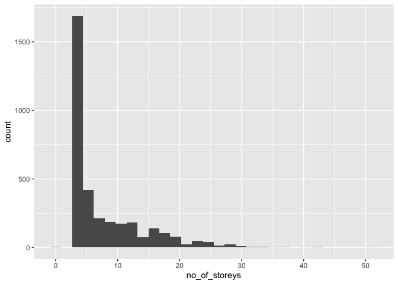
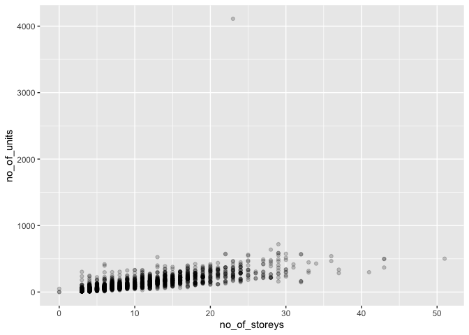
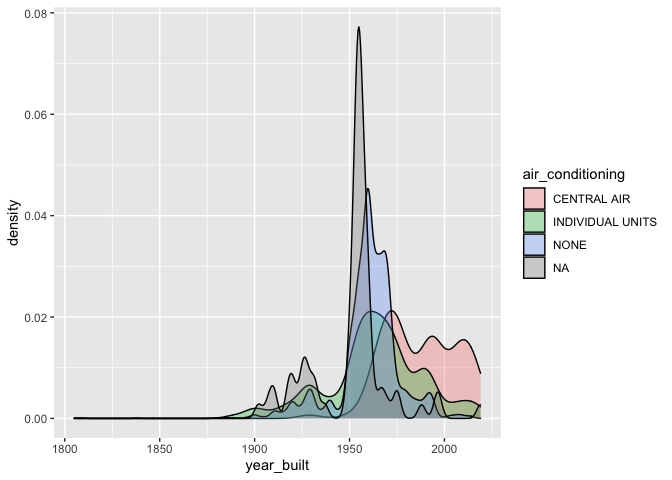

# Welcome to your (maybe) first-ever data analysis project!

And hopefully the first of many. Let’s get started:

1.  Install the [`datateachr`](https://github.com/UBC-MDS/datateachr)
    package by typing the following into your **R terminal**:

<!-- -->

    install.packages("devtools")
    devtools::install_github("UBC-MDS/datateachr")

1.  Load the packages below.

<!-- -->

    library(datateachr)
    library(tidyverse)

    ## Warning: package 'tidyverse' was built under R version 4.0.2

    ## ── Attaching packages ─────────────────────────────────────── tidyverse 1.3.1 ──

    ## ✓ ggplot2 3.3.5     ✓ purrr   0.3.4
    ## ✓ tibble  3.1.5     ✓ dplyr   1.0.7
    ## ✓ tidyr   1.1.3     ✓ stringr 1.4.0
    ## ✓ readr   2.0.2     ✓ forcats 0.5.1

    ## Warning: package 'ggplot2' was built under R version 4.0.2

    ## Warning: package 'tibble' was built under R version 4.0.2

    ## Warning: package 'tidyr' was built under R version 4.0.2

    ## Warning: package 'readr' was built under R version 4.0.2

    ## Warning: package 'dplyr' was built under R version 4.0.2

    ## Warning: package 'forcats' was built under R version 4.0.2

    ## ── Conflicts ────────────────────────────────────────── tidyverse_conflicts() ──
    ## x dplyr::filter() masks stats::filter()
    ## x dplyr::lag()    masks stats::lag()

    library(ggplot2)

1.  Make a repository in the <https://github.com/stat545ubc-2021>
    Organization. You will be working with this repository for the
    entire data analysis project. You can either make it public, or make
    it private and add the TA’s and Vincenzo as collaborators.

2.  When you go to submit, submit a URL to your repository to canvas.

# Instructions

More details regarding the instructions and points allocated to each
task can be found below. Briefly,

-   Each milestone is worth 30 points. The number of points allocated to
    each task will be annotated within each deliverable. Tasks that are
    more challenging will often be allocated more points.

-   10 points will be allocated to the reproducibility, cleanliness, and
    coherence of the analysis. While the three milestones will be
    submitted as independent deliverables, the analysis itself is a
    continuum - think of it as 3 chapters to a story. Each chapter, or
    in this case, portion of your analysis, should be easily followed
    through by someone unfamiliar with the content.
    [Here](https://swcarpentry.github.io/r-novice-inflammation/06-best-practices-R/)
    is a good resource for what constitutes “good code”. Learning good
    coding practices early in your career will save you hassle later on!

# Learning Objectives

By the end of this milestone, you should:

-   Become familiar with your dataset of choosing
-   Think of 4 questions that you would like to answer with your data
-   Generate a reproducible and clear report using R Markdown

# Task 1: Choose your favorite dataset (10 points)

The `datateachr` package by Hayley Boyce and Jordan Bourak currently
composed of 7 semi-tidy datasets for educational purposes. Here is a
brief description of each dataset:

-   *apt\_buildings*: Acquired courtesy of The City of Toronto’s Open
    Data Portal. It currently has 3455 rows and 37 columns.

-   *building\_permits*: Acquired courtesy of The City of Vancouver’s
    Open Data Portal. It currently has 20680 rows and 14 columns.

-   *cancer\_sample*: Acquired courtesy of UCI Machine Learning
    Repository. It currently has 569 rows and 32 columns.

-   *flow\_sample*: Acquired courtesy of The Government of Canada’s
    Historical Hydrometric Database. It currently has 218 rows and 7
    columns.

-   *parking\_meters*: Acquired courtesy of The City of Vancouver’s Open
    Data Portal. It currently has 10032 rows and 22 columns.

-   *steam\_games*: Acquired courtesy of Kaggle. It currently has 40833
    rows and 21 columns.

-   *vancouver\_trees*: Acquired courtesy of The City of Vancouver’s
    Open Data Portal. It currently has 146611 rows and 20 columns.

**Things to keep in mind**

-   We hope that this project will serve as practice for carrying our
    your own *independent* data analysis. Remember to comment your code,
    be explicit about what you are doing, and write notes in this
    markdown document when you feel that context is required. As you
    advance in the project, prompts and hints to do this will be
    diminished - it’ll be up to you!

-   Before choosing a dataset, you should always keep in mind **your
    goal**, or in other ways, *what you wish to achieve with this data*.
    This mini data-analysis project focuses on *data wrangling*,
    *tidying*, and *visualization*. In short, it’s a way for you to get
    your feet wet with exploring data on your own.

And that is exactly the first thing that you will do!

1.1 Out of the 7 datasets available in the `datateachr` package, choose
**4** that appeal to you based on their description. Write your choices
below:

**Note**: We encourage you to use the ones in the `datateachr` package,
but if you have a dataset that you’d really like to use, you can include
it here. But, please check with a member of the teaching team to see
whether the dataset is of appropriate complexity. Also, include a
**brief** description of the dataset here to help the teaching team
understand your data.

1: *apt\_buildings* 2: *vancouver\_trees* 3: *flow\_sample* 4:
*building\_permits*

1.2 One way to narrowing down your selection is to *explore* the
datasets. Use your knowledge of dplyr to find out at least *3*
attributes about each of these datasets (an attribute is something such
as number of rows, variables, class type…). The goal here is to have an
idea of *what the data looks like*.

*Hint:* This is one of those times when you should think about the
cleanliness of your analysis. I added a single code chunk for you, but
do you want to use more than one? Would you like to write more comments
outside of the code chunk?

## 1.2.1. Attributes of the *apt\_buildings* dataset

    # Number of rows in *apt_buildings*

    nrow(apt_buildings)

    ## [1] 3455

    # Number of columns in *apt_buildings*

    ncol(apt_buildings)

    ## [1] 37

    # Data type in each column of *apt_buildings*

    str(apt_buildings)

    ## tibble [3,455 × 37] (S3: tbl_df/tbl/data.frame)
    ##  $ id                              : num [1:3455] 10359 10360 10361 10362 10363 ...
    ##  $ air_conditioning                : chr [1:3455] "NONE" "NONE" "NONE" "NONE" ...
    ##  $ amenities                       : chr [1:3455] "Outdoor rec facilities" "Outdoor pool" NA NA ...
    ##  $ balconies                       : chr [1:3455] "YES" "YES" "YES" "YES" ...
    ##  $ barrier_free_accessibilty_entr  : chr [1:3455] "YES" "NO" "NO" "YES" ...
    ##  $ bike_parking                    : chr [1:3455] "0 indoor parking spots and 10 outdoor parking spots" "0 indoor parking spots and 34 outdoor parking spots" "Not Available" "Not Available" ...
    ##  $ exterior_fire_escape            : chr [1:3455] "NO" "NO" "NO" "YES" ...
    ##  $ fire_alarm                      : chr [1:3455] "YES" "YES" "YES" "YES" ...
    ##  $ garbage_chutes                  : chr [1:3455] "YES" "YES" "NO" "NO" ...
    ##  $ heating_type                    : chr [1:3455] "HOT WATER" "HOT WATER" "HOT WATER" "HOT WATER" ...
    ##  $ intercom                        : chr [1:3455] "YES" "YES" "YES" "YES" ...
    ##  $ laundry_room                    : chr [1:3455] "YES" "YES" "YES" "YES" ...
    ##  $ locker_or_storage_room          : chr [1:3455] "NO" "YES" "YES" "YES" ...
    ##  $ no_of_elevators                 : num [1:3455] 3 3 0 1 0 0 0 2 4 2 ...
    ##  $ parking_type                    : chr [1:3455] "Underground Garage , Garage accessible thru buildg" "Underground Garage , Garage accessible thru buildg , Surface Parking" "Underground Garage , Garage accessible thru buildg , Surface Parking" "Ground Level Garage , Surface Parking" ...
    ##  $ pets_allowed                    : chr [1:3455] "YES" "YES" "YES" "YES" ...
    ##  $ prop_management_company_name    : chr [1:3455] NA "SCHICKEDANZ BROS. PROPERTIES" NA "FREIMAN INVESTMENTS" ...
    ##  $ property_type                   : chr [1:3455] "PRIVATE" "PRIVATE" "PRIVATE" "PRIVATE" ...
    ##  $ rsn                             : num [1:3455] 4154812 4154815 4155295 4155309 4155318 ...
    ##  $ separate_gas_meters             : chr [1:3455] "NO" "NO" "NO" "NO" ...
    ##  $ separate_hydro_meters           : chr [1:3455] "YES" "YES" "YES" "YES" ...
    ##  $ separate_water_meters           : chr [1:3455] "NO" "NO" "NO" "NO" ...
    ##  $ site_address                    : chr [1:3455] "65  FOREST MANOR RD" "70  CLIPPER RD" "2651  BLOOR ST W" "22  BURNHAMTHORPE RD" ...
    ##  $ sprinkler_system                : chr [1:3455] "YES" "YES" "NO" "YES" ...
    ##  $ visitor_parking                 : chr [1:3455] "PAID" "FREE" "UNAVAILABLE" "UNAVAILABLE" ...
    ##  $ ward                            : chr [1:3455] "17" "17" "03" "03" ...
    ##  $ window_type                     : chr [1:3455] "DOUBLE PANE" "DOUBLE PANE" "DOUBLE PANE" "DOUBLE PANE" ...
    ##  $ year_built                      : num [1:3455] 1967 1970 1927 1959 1943 ...
    ##  $ year_registered                 : num [1:3455] 2017 2017 2017 2017 2017 ...
    ##  $ no_of_storeys                   : num [1:3455] 17 14 4 5 4 4 4 7 32 4 ...
    ##  $ emergency_power                 : chr [1:3455] "NO" "YES" "NO" "NO" ...
    ##  $ non-smoking_building            : chr [1:3455] "YES" "NO" "YES" "YES" ...
    ##  $ no_of_units                     : num [1:3455] 218 206 34 42 25 34 14 105 571 171 ...
    ##  $ no_of_accessible_parking_spaces : num [1:3455] 8 10 20 42 12 0 5 1 1 6 ...
    ##  $ facilities_available            : chr [1:3455] "Recycling bins" "Green Bin / Organics" "Green Bin / Organics" "Green Bin / Organics" ...
    ##  $ cooling_room                    : chr [1:3455] "NO" "NO" "NO" "NO" ...
    ##  $ no_barrier_free_accessible_units: num [1:3455] 2 0 0 42 0 NA 14 0 0 1 ...

## 1.2.2. Attributes of the *vancouver\_trees* dataset

    # Number of rows in *vancouver_trees*

    nrow(vancouver_trees)

    ## [1] 146611

    # Number of columns in *vancouver_trees*

    ncol(vancouver_trees)

    ## [1] 20

    # Data type in each column of *vancouver_trees*

    str(vancouver_trees)

    ## tibble [146,611 × 20] (S3: tbl_df/tbl/data.frame)
    ##  $ tree_id           : num [1:146611] 149556 149563 149579 149590 149604 ...
    ##  $ civic_number      : num [1:146611] 494 450 4994 858 5032 ...
    ##  $ std_street        : chr [1:146611] "W 58TH AV" "W 58TH AV" "WINDSOR ST" "E 39TH AV" ...
    ##  $ genus_name        : chr [1:146611] "ULMUS" "ZELKOVA" "STYRAX" "FRAXINUS" ...
    ##  $ species_name      : chr [1:146611] "AMERICANA" "SERRATA" "JAPONICA" "AMERICANA" ...
    ##  $ cultivar_name     : chr [1:146611] "BRANDON" NA NA "AUTUMN APPLAUSE" ...
    ##  $ common_name       : chr [1:146611] "BRANDON ELM" "JAPANESE ZELKOVA" "JAPANESE SNOWBELL" "AUTUMN APPLAUSE ASH" ...
    ##  $ assigned          : chr [1:146611] "N" "N" "N" "Y" ...
    ##  $ root_barrier      : chr [1:146611] "N" "N" "N" "N" ...
    ##  $ plant_area        : chr [1:146611] "N" "N" "4" "4" ...
    ##  $ on_street_block   : num [1:146611] 400 400 4900 800 5000 500 4900 4900 4900 700 ...
    ##  $ on_street         : chr [1:146611] "W 58TH AV" "W 58TH AV" "WINDSOR ST" "E 39TH AV" ...
    ##  $ neighbourhood_name: chr [1:146611] "MARPOLE" "MARPOLE" "KENSINGTON-CEDAR COTTAGE" "KENSINGTON-CEDAR COTTAGE" ...
    ##  $ street_side_name  : chr [1:146611] "EVEN" "EVEN" "EVEN" "EVEN" ...
    ##  $ height_range_id   : num [1:146611] 2 4 3 4 2 2 3 3 2 2 ...
    ##  $ diameter          : num [1:146611] 10 10 4 18 9 5 15 14 16 7.5 ...
    ##  $ curb              : chr [1:146611] "N" "N" "Y" "Y" ...
    ##  $ date_planted      : Date[1:146611], format: "1999-01-13" "1996-05-31" ...
    ##  $ longitude         : num [1:146611] -123 -123 -123 -123 -123 ...
    ##  $ latitude          : num [1:146611] 49.2 49.2 49.2 49.2 49.2 ...

## 1.2.3. Attributes of the *flow\_sample* dataset

    # Number of rows in *flow_sample*

    nrow(flow_sample)

    ## [1] 218

    # Number of columns in *flow_sample*

    ncol(flow_sample)

    ## [1] 7

    # Data type in each column of *flow_sample*

    str(flow_sample)

    ## tibble [218 × 7] (S3: tbl_df/tbl/data.frame)
    ##  $ station_id  : chr [1:218] "05BB001" "05BB001" "05BB001" "05BB001" ...
    ##  $ year        : num [1:218] 1909 1910 1911 1912 1913 ...
    ##  $ extreme_type: chr [1:218] "maximum" "maximum" "maximum" "maximum" ...
    ##  $ month       : num [1:218] 7 6 6 8 6 6 6 6 6 6 ...
    ##  $ day         : num [1:218] 7 12 14 25 11 18 27 20 17 15 ...
    ##  $ flow        : num [1:218] 314 230 264 174 232 214 236 309 174 345 ...
    ##  $ sym         : chr [1:218] NA NA NA NA ...

## 1.2.4. Attributes of the *building\_permits* dataset

    # Number of rows in *building_permits*

    nrow(building_permits)

    ## [1] 20680

    # Number of columns in *building_permits*

    ncol(building_permits)

    ## [1] 14

    # Data type in each column of *building_permits*

    str(building_permits)

    ## spec_tbl_df [20,680 × 14] (S3: spec_tbl_df/tbl_df/tbl/data.frame)
    ##  $ permit_number              : chr [1:20680] "BP-2016-02248" "BU468090" "DB-2016-04450" "DB-2017-00131" ...
    ##  $ issue_date                 : Date[1:20680], format: "2017-02-01" "2017-02-01" ...
    ##  $ project_value              : num [1:20680] 0 0 35000 15000 181178 ...
    ##  $ type_of_work               : chr [1:20680] "Salvage and Abatement" "New Building" "Addition / Alteration" "Addition / Alteration" ...
    ##  $ address                    : chr [1:20680] "4378 W 9TH AVENUE, Vancouver, BC V6R 2C7" "1111 RICHARDS STREET, Vancouver, BC V1V 1V1" "3732 W 12TH AVENUE, Vancouver, BC V6R 2N6" "88 W PENDER STREET, Vancouver, BC V6B 6N9" ...
    ##  $ project_description        : chr [1:20680] NA NA NA NA ...
    ##  $ building_contractor        : chr [1:20680] NA NA NA "Mercury Contracting Ltd" ...
    ##  $ building_contractor_address: chr [1:20680] NA NA NA "88 W PENDER ST  \r\nUnit 2069\r\nVancouver, BC  V6B 6N9" ...
    ##  $ applicant                  : chr [1:20680] "Raffaele & Associates DBA: Raffaele and Associates" "MAX KERR" "Peter  Nicol" "Aaron Vaughan DBA: Mercury Contracting" ...
    ##  $ applicant_address          : chr [1:20680] "2642 East Hastings\r\nVancouver, BC  V5K 1Z6" "BRENHILL DEVELOPMENTS LTD\r\n487 HELMCKEN ST\r\nVANCOUVER, BC  V5T1R8" "3722 W 12th Ave\r\nVancouver, BC  V6R 2N6" "2097-88 W Pender St\r\nVancouver, BC  V6B 6N9" ...
    ##  $ property_use               : chr [1:20680] "Dwelling Uses" "Dwelling Uses" "Dwelling Uses" "Office Uses,Retail Uses" ...
    ##  $ specific_use_category      : chr [1:20680] "One-Family Dwelling" "Multiple Dwelling" "One-Family Dwelling" "General Office, Retail Store" ...
    ##  $ year                       : num [1:20680] 2017 2017 2017 2017 2017 ...
    ##  $ bi_id                      : num [1:20680] 524 535 539 541 543 546 547 548 549 550 ...
    ##  - attr(*, "spec")=
    ##   .. cols(
    ##   ..   PermitNumber = col_character(),
    ##   ..   IssueDate = col_date(format = ""),
    ##   ..   ProjectValue = col_double(),
    ##   ..   TypeOfWork = col_character(),
    ##   ..   Address = col_character(),
    ##   ..   ProjectDescription = col_character(),
    ##   ..   BuildingContractor = col_character(),
    ##   ..   BuildingContractorAddress = col_character(),
    ##   ..   Applicant = col_character(),
    ##   ..   ApplicantAddress = col_character(),
    ##   ..   PropertyUse = col_character(),
    ##   ..   SpecificUseCategory = col_character(),
    ##   ..   Year = col_double(),
    ##   ..   BI_ID = col_double()
    ##   .. )

1.3 Now that you’ve explored the 4 datasets that you were initially most
interested in, let’s narrow it down to 2. What lead you to choose these
2? Briefly explain your choices below, and feel free to include any code
in your explanation.

*I choose to consider vancouver\_trees and apt\_buildings because they
are both geographic datasets that are related to my interests in urban
planning and forestry. Additionally, both datasets include a variety of
data types that will allow a number of varied analyses.*

1.4 Time for the final decision! Going back to the beginning, it’s
important to have an *end goal* in mind. For example, if I had chosen
the `titanic` dataset for my project, I might’ve wanted to explore the
relationship between survival and other variables. Try to think of 1
research question that you would want to answer with each dataset. Note
them down below, and make your final choice based on what seems more
interesting to you!

*For the vancouver\_trees dataset, I could explore the relationships
between tree height or diameter and other variables, such as tree
species, neighbourhood, or tree age.*

*For the apt\_buildings dataset, I could explore the relationship
between building age and variables such as building height. I could also
explore relationships between building height and other variables, such
as ward, number of units, or number of parking spaces.*

*I will work with apt\_buildings because there I can form many
hypotheses about possible relationships that might exist in the data,
and would be interested in testing these hypotheses. The dataset also
includes many variables with a variety of data types, allowing a large
variety of relationships to be explored. And lastly, I grew up near
Toronto and am very familiar with the city, which makes this dataset
especially interesting and meaningful.*

# Important note

Read Tasks 2 and 3 *fully* before starting to complete either of them.
Probably also a good point to grab a coffee to get ready for the fun
part!

This project is semi-guided, but meant to be *independent*. For this
reason, you will complete tasks 2 and 3 below (under the **START HERE**
mark) as if you were writing your own exploratory data analysis report,
and this guidance never existed! Feel free to add a brief introduction
section to your project, format the document with markdown syntax as you
deem appropriate, and structure the analysis as you deem appropriate.
Remember, marks will be awarded for completion of the 4 tasks, but 10
points of the whole project are allocated to a reproducible and clean
analysis. If you feel lost, you can find a sample data analysis
[here](https://www.kaggle.com/headsortails/tidy-titarnic) to have a
better idea. However, bear in mind that it is **just an example** and
you will not be required to have that level of complexity in your
project.

# Task 2: Exploring your dataset (15 points)

If we rewind and go back to the learning objectives, you’ll see that by
the end of this deliverable, you should have formulated *4* research
questions about your data that you may want to answer during your
project. However, it may be handy to do some more exploration on your
dataset of choice before creating these questions - by looking at the
data, you may get more ideas. **Before you start this task, read all
instructions carefully until you reach START HERE**.

2.1 Complete *4 out of the following 8 exercises* to dive deeper into
your data. All datasets are different and therefore, not all of these
tasks may make sense for your data - which is why you should only answer
*4*. Use *dplyr* and *ggplot*.

1.  Plot the distribution of a numeric variable.
2.  Create a new variable based on other variables in your data (only if
    it makes sense)
3.  Investigate how many missing values there are per variable. Can you
    find a way to plot this?
4.  Explore the relationship between 2 variables in a plot.
5.  Filter observations in your data according to your own criteria.
    Think of what you’d like to explore - again, if this was the
    `titanic` dataset, I may want to narrow my search down to passengers
    born in a particular year…
6.  Use a boxplot to look at the frequency of different observations
    within a single variable. You can do this for more than one variable
    if you wish!
7.  Make a new tibble with a subset of your data, with variables and
    observations that you are interested in exploring.
8.  Use a density plot to explore any of your variables (that are
    suitable for this type of plot).

2.2 For each of the 4 exercises that you complete, provide a *brief
explanation* of why you chose that exercise in relation to your data (in
other words, why does it make sense to do that?), and sufficient
comments for a reader to understand your reasoning and code.

## 2.2.1. Exploring the distribution of *no\_of\_storeys*

*I chose to explore the variable no\_of\_storeys using a histogram. This
will allow me to gain an understanding of the range and distribution of
the number of storeys that the buildings in the dataset have.*

    # Save the plot in a variable named apt_buidings_histogram
    # Specify apt_buildings as the dataset to plot and no_of_storeys as the aesthetic mapping
    # Specify geom_histogram() as the plot type

    (apt_buidings_histogram <- ggplot(apt_buildings, aes(no_of_storeys)) +
       geom_histogram())

    ## `stat_bin()` using `bins = 30`. Pick better value with `binwidth`.

*This plot shows that buildings are mostly only a few stories tall, with
the large majority of the remaining buildings below 30 stories.*

## 2.2.2. Creating a new variable: proportion of units that are accessible

*The proportion of units that are accessible, denoted
f\_accessible\_units, can be calculated by dividing
no\_barrier\_free\_accessible\_units by no\_of\_units. Compared to the
absolute number of accessible units, this variable provides a more
meaningful measure of a building’s overall accessibility.*

    # Create a new tibble apt_buildings_new to house the existing data and new variable
    # Calculate f_accessible_units by dividing no_barrier_free_accessible_units by no_of_units
    # Place the new variable as the last column after the previous data
    # Use *head* to explore the new dataset

    apt_buildings_new <- apt_buildings %>%
      mutate(f_accessible_units = no_barrier_free_accessible_units/no_of_units) %>%
      select(id:no_barrier_free_accessible_units, f_accessible_units)

    head(apt_buildings_new)

    ## # A tibble: 6 × 38
    ##      id air_conditioning amenities   balconies barrier_free_acc… bike_parking   
    ##   <dbl> <chr>            <chr>       <chr>     <chr>             <chr>          
    ## 1 10359 NONE             Outdoor re… YES       YES               0 indoor parki…
    ## 2 10360 NONE             Outdoor po… YES       NO                0 indoor parki…
    ## 3 10361 NONE             <NA>        YES       NO                Not Available  
    ## 4 10362 NONE             <NA>        YES       YES               Not Available  
    ## 5 10363 NONE             <NA>        NO        NO                12 indoor park…
    ## 6 10364 NONE             <NA>        NO        NO                Not Available  
    ## # … with 32 more variables: exterior_fire_escape <chr>, fire_alarm <chr>,
    ## #   garbage_chutes <chr>, heating_type <chr>, intercom <chr>,
    ## #   laundry_room <chr>, locker_or_storage_room <chr>, no_of_elevators <dbl>,
    ## #   parking_type <chr>, pets_allowed <chr>, prop_management_company_name <chr>,
    ## #   property_type <chr>, rsn <dbl>, separate_gas_meters <chr>,
    ## #   separate_hydro_meters <chr>, separate_water_meters <chr>,
    ## #   site_address <chr>, sprinkler_system <chr>, visitor_parking <chr>, …

## 2.2.3. Exploring the relationship between *no\_of\_units* and *no\_of\_storey*

*Because larger buildings can generally accommodate more units, it might
be expected that a building with a larger number of stories can
accomodate more units. This relationship was explored by creating a
scatter plot of these two variables.*

    # Save the plot in a variable named apt_buildings_scatter_plot
    # Specify apt_buildings as the dataset to plot and no_of_storeys as the aesthetic mapping
    # Specify geom_histogram() as the plot type

    (apt_buildings_scatter_plot <- ggplot(apt_buildings) +
        geom_point(aes(no_of_storeys, no_of_units), alpha = 0.2))

*This plot shows that there is a moderate positive correlation between
number of storeys and number of units. One notable outlier occurs with
over 4000 units and 24 storeys. With many more units per storey than the
other buildings, this building is presumably much longer and/or wider
than the others.*

## 2.2.4. Exploring the distribution of *year\_built* in relation to *air\_conditioning*

*This analysis explores the distributions of buildings’ age as separated
by the type of air conditioning in that building. For example, we might
assume that older buildings are less likely to have central air
conditioning.*

    # Save the plot in a variable named apt_buildings_scatter_plot
    # Specify apt_buildings as the dataset to plot and no_of_storeys as the aesthetic mapping
    # Specify geom_histogram() as the plot type

    (apt_buildings_density_plot <- ggplot(apt_buildings, aes(x = year_built)) + 
        geom_density(aes(fill = air_conditioning), alpha = 0.3))

    ## Warning: Removed 13 rows containing non-finite values (stat_density).

*This visualization confirms there is a higher incidence of older
buildings, particularly those built between about 1950 and 1975, that do
not have air conditioning. In contrast, buildings with central air
conditioning tend to be newer.*

# Task 3: Write your research questions (5 points)

So far, you have chosen a dataset and gotten familiar with it through
exploring the data. Now it’s time to figure out 4 research questions
that you would like to answer with your data! Write the 4 questions and
any additional comments at the end of this deliverable. These questions
are not necessarily set in stone - TAs will review them and give you
feedback; therefore, you may choose to pursue them as they are for the
rest of the project, or make modifications!

## 3.1. Research question 1: Investigating building age dependency of other columns

Investigate whether other variables in the dataset depend on or
correlate with the age of the building. For example, the analysis in
section 2.2.4 seems to suggest that central air conditioning is most
prevalent in newer buildings. Similarly, one could hypothesize that
other factors such as accessible parking spaces, accessible units, or
bike parking spaces might be more prevalent in newer buildings.

## 3.2. Research question 2: Investigating building number of units dependency of other columns

Investigate whether other variables in the dataset depend on or
correlate with the age of the building. For example, the analysis in
section 2.2.3 seems to suggest that buildings with more units have more
storeys. Similarly, one could hypothesize that other factors such as
number of parking spaces might also positively correlate with number of
units.

## 3.3. Research question 3: Investigating building height dependency of other columns

Investigate whether other variables in the dataset depend on or
correlate with the number of storeys. For example, one could hypothesize
that factors such as number of elevators might positively correlate with
the number of units.

## 3.4. Research question 4: Investigating building location dependency of other columns

Investigate whether other variables in the dataset depend on or
correlate with the location of the building. For example, one could
hypothesize that older buildings or buildings with more storeys or more
units might be concentrated in certain locations. Because the dataset
does not provide exact geographic coordinates, this question is less
straightforward to answer than the previous three. For example,
buildings could be grouped by their ward, providing a rough location. It
might also be possible to extract the street name from the
*site\_address* variable. However, because streets in Toronto can be
very long, grouping by street name might be an uninformative measure of
location.

<!--- *****START HERE***** --->

### Attribution

Thanks to Icíar Fernández Boyano for mostly putting this together, and
Vincenzo Coia for launching.
